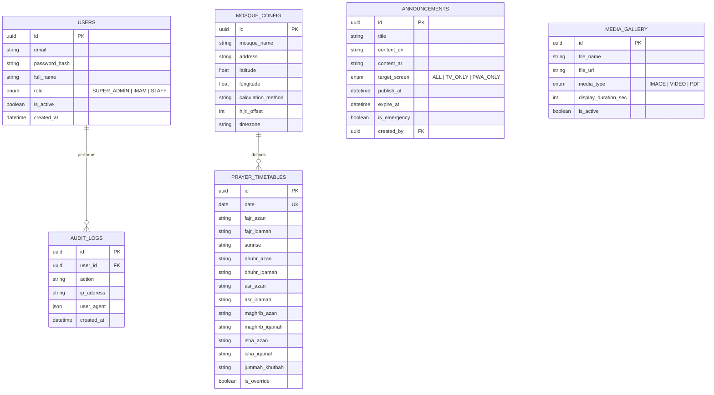

# 💾 Volume 7 – Backend & Database
**Comprehensive Architectural Specification, Database Schemas, API Definitions & Security Matrix for BIN FAIZAL'S Mosque Services**

---

## 1. Executive Architectural Blueprint

The backend system of **BIN FAIZAL'S Mosque Services** is engineered as a high-throughput, microservice-ready backend built on top of **Node.js**, **TypeScript**, **Next.js API Routes / Express Engine**, and **PostgreSQL / Supabase** with **Prisma ORM**.

```
+-----------------------------------------------------------------------------------+
|                               Client Request Layer                                |
|  [Android TV Display]          [Public Web & PWA]           [Admin Web Dashboard] |
+-----------------------------------------------------------------------------------+
                                          |
                                          v HTTPS / TLS 1.3
+-----------------------------------------------------------------------------------+
|                         Cloudflare CDN & Edge Rate Limiter                        |
+-----------------------------------------------------------------------------------+
                                          |
                                          v
+-----------------------------------------------------------------------------------+
|                             Next.js / Node.js API Gateway                         |
|  +--------------------+  +-----------------------+  +--------------------------+  |
|  | JWT / Cookie Auth  |  | Zod Input Validator   |  | Throttler / Rate Limit   |  |
|  +--------------------+  +-----------------------+  +--------------------------+  |
+-----------------------------------------------------------------------------------+
                                          |
        +---------------------------------+---------------------------------+
        |                                 |                                 |
        v                                 v                                 v
+-----------------------+     +-----------------------+     +-----------------------+
|  Prayer Time Controller|     | Content & Media Service|     |  Admin Telemetry Engine|
+-----------------------+     +-----------------------+     +-----------------------+
        |                                 |                                 |
        +---------------------------------+---------------------------------+
                                          |
                                          v
+-----------------------------------------------------------------------------------+
|                                Prisma ORM Layer                                   |
+-----------------------------------------------------------------------------------+
                                          |
                                          v
+-----------------------------------------------------------------------------------+
|                         PostgreSQL Primary Database                               |
| (Tables: users, prayer_timetables, announcements, media_gallery, audit_logs)      |
+-----------------------------------------------------------------------------------+
```

---

## 2. Entity-Relationship (ER) Architecture



---

## 3. Database Schema Definitions (Prisma Schema Specification)

```prisma
datasource db {
  provider = "postgresql"
  url      = env("DATABASE_URL")
}

generator client {
  provider = "prisma-client-js"
}

enum Role {
  SUPER_ADMIN
  IMAM
  STAFF
}

enum ScreenTarget {
  ALL
  TV_ONLY
  PWA_ONLY
}

enum MediaType {
  IMAGE
  VIDEO
  PDF
}

model User {
  id            String     @id @default(uuid())
  email         String     @unique
  passwordHash  String
  fullName      String
  role          Role       @default(STAFF)
  isActive      Boolean    @default(true)
  createdAt     DateTime   @default(now())
  updatedAt     DateTime   @updatedAt
  auditLogs     AuditLog[]

  @@map("users")
}

model MosqueConfig {
  id                String   @id @default(uuid())
  mosqueName        String
  address           String
  latitude          Float
  longitude         Float
  calculationMethod String   @default("MWL")
  asrSchool         String   @default("SHAFI")
  hijriOffset       Int      @default(0)
  timezone          String   @default("UTC")
  createdAt         DateTime @default(now())
  updatedAt         DateTime @updatedAt

  @@map("mosque_configs")
}

model PrayerTimetable {
  id            String   @id @default(uuid())
  date          DateTime @unique @db.Date
  fajrAzan      String
  fajrIqamah    String
  sunrise       String
  dhuhrAzan     String
  dhuhrIqamah   String
  asrAzan       String
  asrIqamah     String
  maghribAzan   String
  maghribIqamah String
  ishaAzan      String
  ishaIqamah    String
  jummahKhutbah String?
  isOverride    Boolean  @default(false)
  createdAt     DateTime @default(now())

  @@map("prayer_timetables")
}

model Announcement {
  id           String       @id @default(uuid())
  title        String
  contentEn    String
  contentAr    String?
  targetScreen ScreenTarget @default(ALL)
  publishAt    DateTime
  expireAt     DateTime
  isEmergency  Boolean      @default(false)
  createdAt    DateTime     @default(now())

  @@map("announcements")
}

model MediaGallery {
  id                 String    @id @default(uuid())
  fileName           String
  fileUrl            String
  mediaType          MediaType
  displayDurationSec Int       @default(10)
  isActive           Boolean   @default(true)
  createdAt          DateTime  @default(now())

  @@map("media_gallery")
}

model AuditLog {
  id        String   @id @default(uuid())
  userId    String
  user      User     @relation(fields: [userId], references: [id], onDelete: Cascade)
  action    String
  ipAddress String
  createdAt DateTime @default(now())

  @@map("audit_logs")
}
```

---

## 4. API Endpoints Specification

### 4.1 Public & Device Endpoints

#### `GET /api/v1/timetable/today`
- **Description**: Returns today's prayer schedule, Iqamah delays, and active Hijri date.
- **Response**:
```json
{
  "status": "success",
  "data": {
    "date": "2026-07-27",
    "hijriDate": "12 Safar 1448 AH",
    "timings": {
      "fajr": { "azan": "04:15", "iqamah": "04:30" },
      "sunrise": "05:45",
      "dhuhr": { "azan": "12:30", "iqamah": "12:45" },
      "asr": { "azan": "15:45", "iqamah": "16:00" },
      "maghrib": { "azan": "18:50", "iqamah": "18:55" },
      "isha": { "azan": "20:10", "iqamah": "20:25" }
    }
  }
}
```

#### `GET /api/v1/content/slides`
- **Description**: Retrieves active announcement slides and media items for the TV carousel.

---

## 5. Security, Rate Limiting & Error Matrix

1. **Security**: Mandatory TLS 1.3, CSP header enforcement, CORS configuration allowing TV domains only.
2. **Rate Limiting**: Public APIs restricted to 120 requests/min per IP using Redis sliding window counter.
3. **Error Codes**:
   - `400 Bad Request`: Input validation failed (Zod error).
   - `401 Unauthorized`: Token expired or missing.
   - `403 Forbidden`: Insufficient role permission.
   - `429 Too Many Requests`: Throttled.
   - `500 Internal Server Error`: Masked internal failure log.
