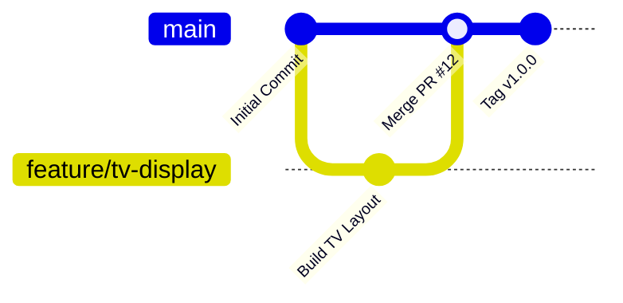

# 🚀 Volume 8 – Production & Deployment
**CI/CD Automation, Vercel Setup, Android TV APK Compilation & Maintenance Manual for BIN FAIZAL'S Mosque Services**

---

## 1. CI/CD Deployment Architecture

The deployment pipeline is fully automated using **GitHub Actions**, **Vercel Cloud Hosting**, and automated **Android APK builders**.



---

## 2. Web & Admin Deployment on Vercel

1. **Repository Link**: Connect GitHub repository to Vercel Project.
2. **Framework Preset**: Next.js.
3. **Environment Variables Configured**:
   - `DATABASE_URL` (PostgreSQL / Supabase Connection URI)
   - `JWT_SECRET` (Cryptographic key)
   - `NEXT_PUBLIC_MOSQUE_NAME`
4. **Deploy Hooks**: Automated production deployments triggered on push to `main`.

---

## 3. Android TV APK Build Guide

### Step 1: Web App Export / PWA Build
```bash
# Build static PWA assets for Android TV Webview package
npm run build
```

### Step 2: Android Studio / Gradle APK Compilation
```bash
cd android-tv-kiosk
./gradlew assembleRelease
```
Outputs `app-release.apk` ready for TV installation.

---

## 4. Hardware TV Installation Walkthrough

1. **Enable Developer Options on Android TV**:
   - Go to `Settings -> Device Preferences -> About`.
   - Click `Build` 7 times until "You are now a developer!" appears.
2. **Enable Unknown Sources & ADB Debugging**:
   - Toggle `Install unknown apps` -> `ON`.
3. **Sideload APK via USB or Downloader App**:
   - Transfer `app-release.apk` to USB drive or download via Android TV browser.
   - Install APK.
4. **Configure Auto-Boot Permission**:
   - Launch app once to grant `Draw over other apps` and `Wake Lock` permissions.
   - Reboot TV device to test automatic launch.

---

## 5. System Health Monitoring & Backups

- **Sentry / LogRocket Integration**: Tracks real-time JavaScript errors on TV displays and web clients.
- **Automated Database Backups**: Daily PostgreSQL snapshots compressed and stored in encrypted S3 bucket with 30-day retention.
